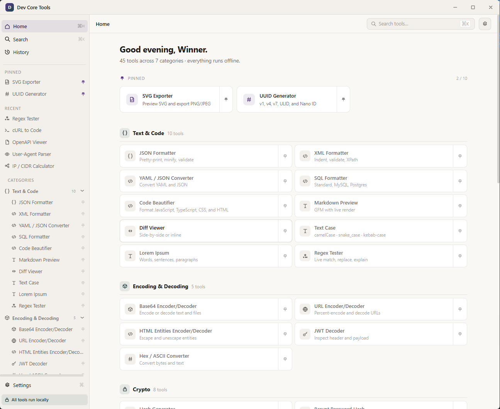
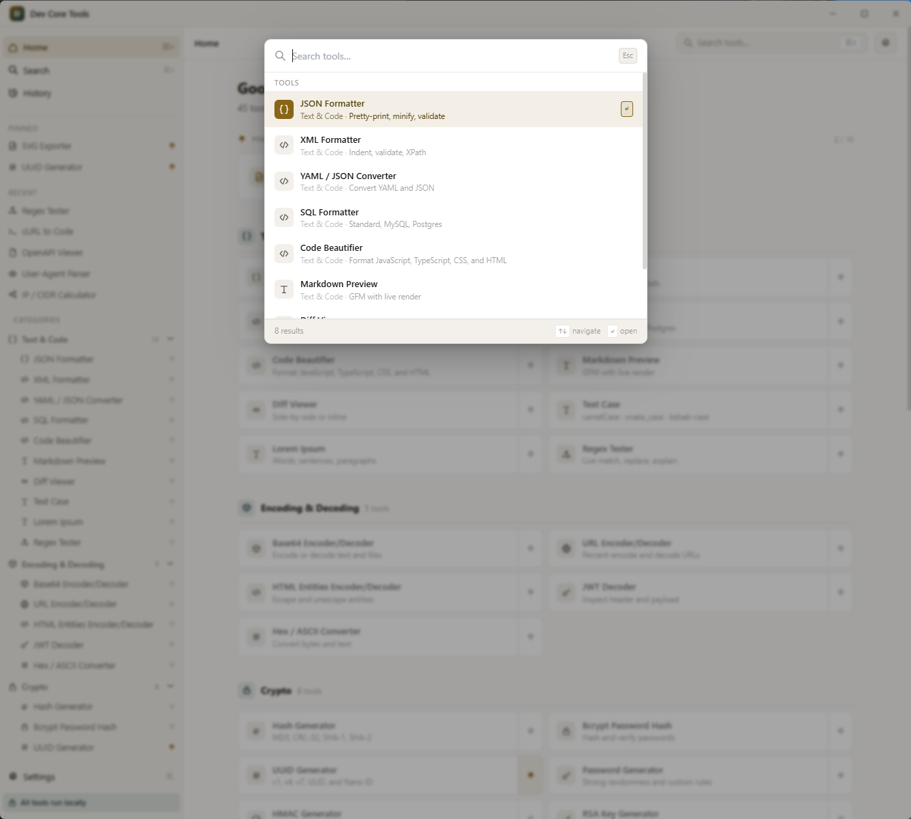
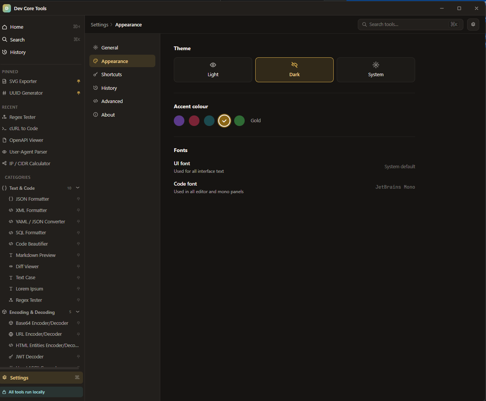
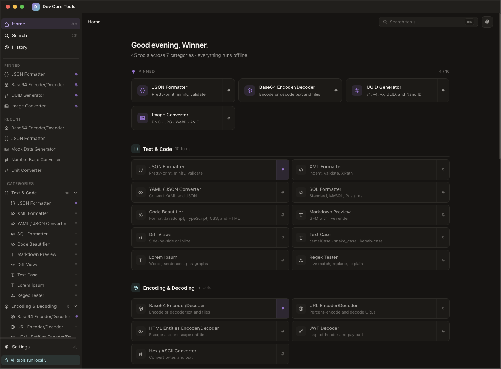
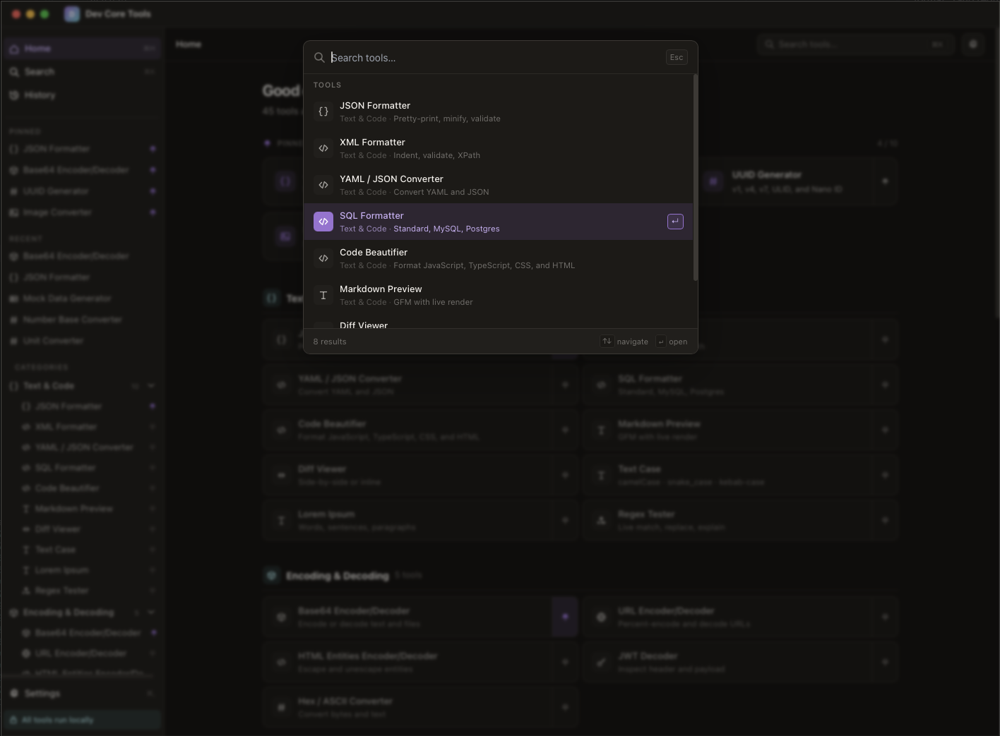
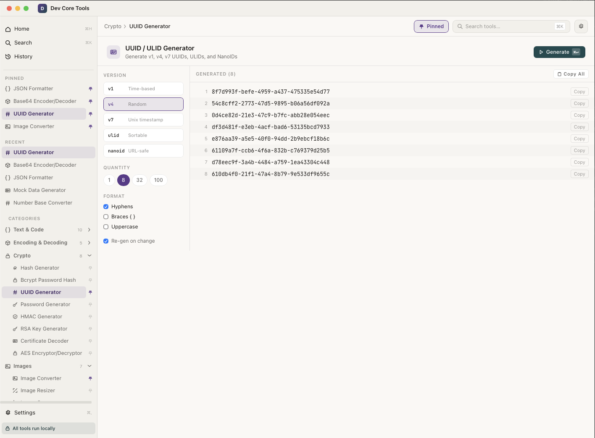

<div align="center">
  
</div>

# Dev Core Tools

[](https://github.com/bolorundurowb/dev-core-tools/actions/workflows/ci.yml) [](LICENSE)

Dev Core Tools is a local-first desktop app that brings everyday developer utilities into one fast, offline workspace. It combines an Angular 21 interface with a Tauri v2 shell and Rust commands for native capabilities such as image processing, hashing, and file access.

The app is designed for common "paste, inspect, convert, generate" tasks without sending data to a remote service.

> **Provenance**: This project was built with extensive assistance from AI agents. Every feature and capability has been thoroughly tested to ensure a high-quality, reliable experience.

## Highlights

- 45+ tools for formatting, encoding, crypto, images, networking, data conversion, and generated test data.
- Local-first workflow for sensitive snippets, tokens, images, and configuration files.
- Native desktop packaging through Tauri for Windows, macOS, and Linux.
- Angular standalone components, lazy-loaded tool routes, and Tailwind-based styling.
- Command palette, pinned tools, first-run experience, and light/dark/system themes.

## Screenshots

**Windows**

| Home                                            | Command Palette                                            | Settings                                            |
|-------------------------------------------------|------------------------------------------------------------|-----------------------------------------------------|
|  |  |  |

**macOS**

| Home                                        | Command Palette                                        | Tool View                                             |
|---------------------------------------------|--------------------------------------------------------|-------------------------------------------------------|
|  |  |  |

## Tool Categories

| Category         | Examples                                                                                         |
|------------------|--------------------------------------------------------------------------------------------------|
| Text & Code      | JSON, XML, YAML, SQL, JS/TS beautifier, Markdown preview, diff viewer, regex tester, Lorem Ipsum |
| Encoding         | Base64, URL encoding, HTML entities, JWT decoder, hex/ASCII, string escaper, text case converter |
| Hashing & Crypto | Hash generator, bcrypt, HMAC, AES, RSA keygen, UUIDs, password generator, cert decoder           |
| Images           | Converter, resizer, cropper, SVG optimizer, SVG exporter, color tools, color palette             |
| Web & Network    | Cron parser, Unix time, QR codes, IP/CIDR, user-agent parser, cURL-to-code, OpenAPI viewer       |
| Data Transform   | CSV↔JSON, JSON↔TOML, JSON Schema generation, datetime utilities                                  |
| Utilities        | Unit converter, number base converter, mock data generator, string escaper                       |

## Tech Stack

- Angular 21.2 and TypeScript 5.9
- Tauri v2.11 and Rust 1.77.2+
- Tailwind CSS 3
- Karma and Jasmine for Angular unit tests
- Rust crates for image processing, hashing, HMAC, bcrypt, UUIDs, and Tauri plugins

## Installation

Pre-built installers are available on the [GitHub Releases](https://github.com/bolorundurowb/dev-core-tools/releases) page. Download the package for your platform and follow the steps below — no build toolchain required.

### Windows

| File    | Type           | Notes                               |
|---------|----------------|-------------------------------------|
| `*.msi` | MSI installer  | Recommended — supports auto-updates |
| `*.exe` | NSIS installer | Standalone executable installer     |

1. Download the `.msi` or `.exe` from the latest release.
2. Run the installer and follow the prompts.
3. Launch **Dev Core Tools** from the Start Menu.

### macOS

1. Download the `.dmg` from the latest release.
2. Open the disk image and drag **Dev Core Tools** into your **Applications** folder.
3. On first launch, right-click the app and choose **Open** to bypass the Gatekeeper prompt (the app is not yet notarised).

### Linux

| File         | Distro family            | Notes                             |
|--------------|--------------------------|-----------------------------------|
| `*.deb`      | Debian / Ubuntu          | Install with `sudo dpkg -i *.deb` |
| `*.rpm`      | Fedora / RHEL / openSUSE | Install with `sudo rpm -i *.rpm`  |
| `*.AppImage` | Any                      | Mark executable and run directly  |

**Debian / Ubuntu:**
```bash
sudo dpkg -i dev-core-tools_*.deb
```

**Fedora / RHEL:**
```bash
sudo rpm -i dev-core-tools_*.rpm
```

**AppImage (any distro):**
```bash
chmod +x dev-core-tools_*.AppImage
./dev-core-tools_*.AppImage
```

## Quick Start

Prerequisites:

- Node.js 20.19+, 22.12+, or 24+
- Rust 1.77.2 or newer
- Tauri v2 system dependencies for your platform
- Tauri CLI v2 through Cargo or npm

```bash
npm install
npm run tauri:dev
```

The Angular dev server runs on `http://localhost:4200`, and Tauri opens the desktop window against that dev server.

For a browser-only development loop:

```bash
npm start
```

For production desktop bundles:

```bash
npm run tauri:build
```

Build outputs are written under `src-tauri/target/release/bundle/`.

## Common Scripts

| Command               | Purpose                                                |
|-----------------------|--------------------------------------------------------|
| `npm start`           | Run the Angular dev server on port 4200                |
| `npm run build`       | Build the Angular frontend                             |
| `npm test`            | Run Angular unit tests with Karma/Jasmine              |
| `npm run tauri:dev`   | Run Angular and the Tauri desktop shell in development |
| `npm run tauri:build` | Build production desktop bundles                       |

## Project Layout

```text
Dev Core Tools/
├── src/                 Angular application
│   ├── app/core/        Tool catalog, shared icons, and services
│   ├── app/layout/      Shell, sidebar, topbar, and command palette
│   ├── app/pages/       Home, first-run, settings, and about pages
│   └── app/tools/       Lazy-loaded tool components
├── src-tauri/           Tauri configuration and Rust backend commands
├── public/              Static frontend assets
└── CONTRIBUTING.md      Contributor workflow and project standards
```

## Contributing

Contributions are welcome. Start with [CONTRIBUTING.md](CONTRIBUTING.md) for setup expectations, coding conventions, checks to run, and guidance for adding new tools.

## License

Dev Core Tools is released under the MIT license.
